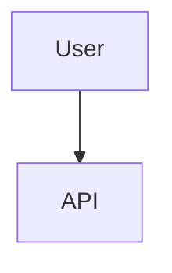

# Phase 2: Design

**Goal:** Propose technical solutions, analyze trade-offs, and define the architectural approach.

## Protocol

### 1. Solutioning
- **Draft Options**: Consider at least 2 approaches (e.g., "Inline Logic" vs "New Service").
- **Analyze Impact**: How does this affect performance, maintainability, and security?
- **Select Winner**: Choose the best approach based on project goals.

### 2. Execution (Double-Write)
Generate the following artifacts in `architecture/`:

#### A. Human-Readable: `architecture/02-design.md`
```markdown
# Phase 2: Design

## Options Considered
1. **Option A**: [Description] - [Pros/Cons]
2. **Option B**: [Description] - [Pros/Cons]

## Selected Approach: Option A
### Architecture Definition
- **Data Flow**: User -> API -> Controller -> DB
- **New Components**: `AuthMiddleware`
- **Modified Components**: `UserController`

### Diagrams


#### B. Machine-Enforceable: `architecture/02-design.json`
*Must validate against `schemas/design-spec.schema.json`*
```json
{
    "phase": "design",
    "architectural_changes": [
        {
            "component": "AuthService",
            "change_type": "NEW",
            "description": "Handles JWT generation"
        }
    ],
    "component_impact": ["UserAPI", "DB"],
    "alternatives_considered": [
        {
            "name": "Session Auth",
            "pros": ["Simple"],
            "cons": ["Stateful"],
            "selected": false
        }
    ]
}
```

## Routing
Proceed to **Phase 3: Security**.
