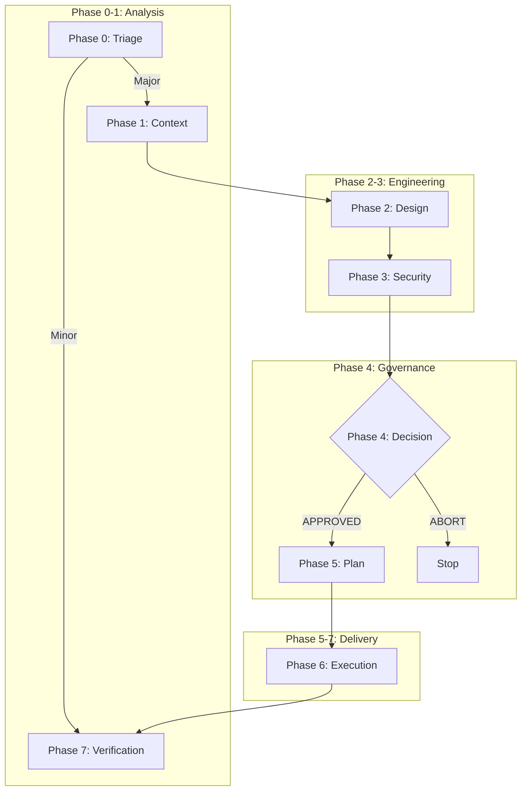

# SDLC AI

**AI-Assisted Software Development Life Cycle (Governance System)**

This repository hosts the **SDLC AI** system, a mature governance framework designed to enforce security, architectural integrity, and deterministic execution in AI-assisted coding workflows.

## 🚀 Quick Start

### Prerequisites
- **Antigravity** (Google Deepmind) or compatible AI agent environment.
- **Node.js 16+** (for schema validation).
- **Python 3.9+** (if running Python examples).

### Your First Workflow
1.  **Initialize**: Copy `templates/00-triage.template.md` to `architecture/00-triage.md`.
2.  **Define**: Describe your change in the Triage document.
3.  **Validate**: Run `pre-commit run --all-files` to check your JSON.
4.  **Execute**: Follow the 8-phase workflow below.

## 📚 Documentation
- **Core Governance**: [FLOW_AND_GOVERNANCE.md](governance/FLOW_AND_GOVERNANCE.md)
- **Workflows**: [.agent/workflows/](.agent/workflows/)
- **Schemas**: [schemas/](schemas/)
- **Templates**: [templates/](templates/)
- **Examples**: [examples/](examples/)

## ⚡ 8-Phase Workflow

| Phase | Name | Artifacts | Goal |
| :--- | :--- | :--- | :--- |
| **0** | **Triage** | `00-triage.{md,json}` | Classify risk (Major vs Minor). |
| **1** | **Context** | `01-context.{md,json}` | Analyze blast radius & dependencies. |
| **2** | **Design** | `02-design.{md,json}` | Architectural Design & Trade-offs. |
| **3** | **Security** | `03-security.{md,json}` | Threat Modeling (STRIDE). |
| **4** | **Decision** | `04-decision.{md,json}` | **Human Gate**: Approve or Abort. |
| **5** | **Plan** | `05-plan.{md,json}` | Deterministic execution plan. |
| **6** | **Execute** | `06-report.md` | Coding & Implementation. |
| **7** | **Verify** | `07-verify.md` | Final Quality Gate. |

### Visual Workflow


## 🛠 Features

### Double-Write Rule
Every phase produces two artifacts:
1.  **Human-Readable (`.md`)**: For reasoning, audit, and communication.
2.  **Machine-Enforceable (`.json`)**: For strict validation and automation.

### Human Firewall
**Phase 4** requires an explicit human signature in the `04-decision.json` file. The AI agent is forbidden from proceeding to code generation without this signed authorization.

### Automated Validation
We use JSON Schema to strictly validate all governance artifacts.
- **CI/CD**: GitHub Actions workflow automatically validates all PRs.
- **Local**: Pre-commit hooks ensure validity before commit.

## 📂 Project Structure
```
.
├── .agent/workflows/       # Agent instructions for each phase
├── architecture/           # The "Ledger" - where your artifacts live
├── examples/               # Complete worked examples
├── governance/             # Core rules and philosophy
├── schemas/                # JSON Schemas for validation
└── templates/              # Blank templates for new tasks
```

## 📦 Onboarding to an Existing Project

### Quick Setup (Script)

```bash
# Clone this repo
git clone https://github.com/agarwalvipin/sdlc_ai.git

# Run the onboarding script
cd sdlc_ai
./onboard.sh /path/to/your/project
```

### Manual Setup

```bash
# Copy framework directories
cp -r .agent /path/to/your/project/
cp -r schemas /path/to/your/project/
cp -r templates /path/to/your/project/
cp -r governance /path/to/your/project/

# Create the architecture ledger
mkdir -p /path/to/your/project/architecture
```

📖 See the full [Onboarding Guide](docs/onboarding.md) for details.

## License
MIT
