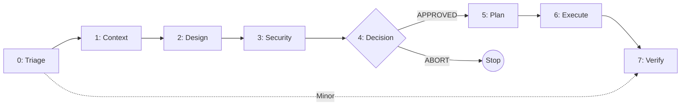

# SDLC AI

**AI-Assisted Software Development Life Cycle (Governance System)**

A mature governance framework designed to enforce security, architectural integrity, and deterministic execution in AI-assisted coding workflows.

[](LICENSE)

---

## 🚀 Quick Start

```bash
# Clone this repo
git clone https://github.com/agarwalvipin/sdlc_ai.git

# Onboard to your project (interactive)
cd sdlc_ai
./onboard.sh /path/to/your/project
```

The script will:
1. Install the **Core Framework** (Phases 0-7).
2. Prompt you to install optional **Add-on Modules** (Data Privacy, Operations).
3. Detect existing installations and run in **Upgrade Mode** if applicable.

---

## ⚡ 8-Phase Workflow

| Phase | Name | Artifacts | Goal |
| :--- | :--- | :--- | :--- |
| **0** | **Triage** | `00-triage.{md,json}` | Classify risk (Major vs Minor). |
| **1** | **Context** | `01-context.{md,json}` | Analyze blast radius & dependencies. |
| **2** | **Design** | `02-design.{md,json}` | Architectural Design & Trade-offs. |
| **3** | **Security** | `03-security.{md,json}` | Threat Modeling (STRIDE). |
| **4** | **Decision** | `04-decision.{md,json}` | **Human Gate**: Approve or Abort. |
| **5** | **Plan** | `05-plan.{md,json}` | Deterministic execution plan. |
| **6** | **Execute** | `06-report.md` | Coding & Implementation. |
| **7** | **Verify** | `07-verify.md` | Final Quality Gate. |



---

## 🧩 Modular Architecture

SDLC AI is designed to be **extensible**. You always start with the **Core Framework**, but can add optional **Governance Modules** based on your project's needs.

### Core Framework (Always Installed)
Phases 0-7 covering Triage, Context, Design, Security, Decision, Planning, Execution, and Verification.

### Add-on Modules (Optional)

| Module | Phase | Trigger | Description |
| :--- | :--- | :--- | :--- |
| **Data Privacy** | 3.5 | Processing PII or user data | GDPR/Sovereignty compliance, data classification, retention policies. |
| **Operations** | 8 | Launching to production | SLIs, Runbooks, escalation policies for Day 2 readiness. |

📖 See [governance/MODULES.md](governance/MODULES.md) for the full module catalog.

### Module Manifest

All modules are declared in [`templates/addons/manifest.json`](templates/addons/manifest.json). This allows:
- **Dynamic Discovery**: `onboard.sh` reads modules from the manifest.
- **Programmatic Triggers**: AI workflows can query the manifest to auto-detect when to invoke add-ons.
- **Easy Extension**: Add a new module by creating a folder and updating the manifest—no script changes required.

---

## 🛠 Key Features

### Double-Write Rule
Every phase produces two artifacts:
1. **Human-Readable (`.md`)**: For reasoning, audit, and communication.
2. **Machine-Enforceable (`.json`)**: For strict validation and automation.

### Human Firewall
**Phase 4** requires an explicit human signature. The AI agent is forbidden from proceeding to code generation without signed authorization.

### Automated Validation
- **CI/CD**: GitHub Actions validates all PRs against JSON Schemas.
- **Local**: Pre-commit hooks ensure validity before commit.

### Interactive Onboarding
```bash
./onboard.sh /path/to/project
```
- Detects existing governance installations (**Upgrade Mode**).
- Prompts for optional modules (Data Privacy, Operations).
- Copies only what's needed—no overwrites without consent.

### Visual Dashboard
Launch the dashboard to explore the governance flow visually:
```bash
python3 -m http.server 8081 --directory docs
# Open http://localhost:8081
```
Toggle "Show Add-ons" to see optional phases (3.5, 8).

---

## 📂 Project Structure

```
.
├── .agent/workflows/           # Agent instructions for each phase
├── architecture/               # The "Ledger" - your project's artifacts
├── docs/                       # Visual dashboard (index.html)
├── examples/                   # Complete worked examples
├── governance/                 # Core rules, modules catalog, changelog rule
│   ├── FLOW_AND_GOVERNANCE.md  # Philosophy and flow
│   ├── MODULES.md              # Available modules catalog
│   └── CHANGELOG_RULE.md       # Changelog discipline
├── schemas/                    # JSON Schemas for validation
├── templates/
│   ├── core/                   # Core phase templates (0-7)
│   └── addons/                 # Optional module templates
│       ├── manifest.json       # Module registry
│       ├── data-privacy/       # Phase 3.5 templates
│       └── operations/         # Phase 8 templates
├── CHANGELOG.md                # Project changelog
├── onboard.sh                  # Interactive onboarding script
└── README.md
```

---

## 📚 Documentation

| Document | Purpose |
| :--- | :--- |
| [FLOW_AND_GOVERNANCE.md](governance/FLOW_AND_GOVERNANCE.md) | Core philosophy and workflow rules. |
| [MODULES.md](governance/MODULES.md) | Catalog of available governance modules. |
| [CHANGELOG_RULE.md](governance/CHANGELOG_RULE.md) | Changelog discipline for contributors. |
| [CHANGELOG.md](CHANGELOG.md) | Project change history. |

---

## 🔄 Upgrading

Already have SDLC AI installed? Run the onboarding script again:

```bash
./onboard.sh /path/to/your/project
```

The script will detect your existing installation and offer to:
- Update Core templates (optional).
- Add new modules you didn't install before.

---

## 🤝 Contributing

1. Follow the [Changelog Discipline](governance/CHANGELOG_RULE.md) for user-facing changes.
2. Validate schemas with `pre-commit run --all-files`.
3. Run the full governance workflow for significant changes.

---

## License

MIT
